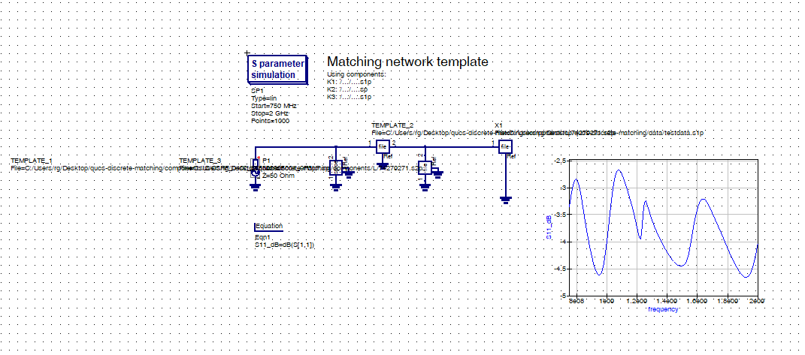

# qucs-discrete-matching

Horrendous simulation for antenna matching networks

> if it looks stupid but works it ain't stupid

## Dependencies
### Linux
```
python3-numpy python3-matplotlib
```

## Arguments

## Instructions
### Quick setup on Ubuntu-based systems
Run `ubuntu-setup.sh` inside `tools/` (read the script before executing it).
The script compiles qucs and installs the python dependencies

### Component Files
Component files (`.sp` or `.s2p`) can be put into the `components/` directory
e.g. `components/C/example.sp`.

You can also specify a path for the component files using the `--componentdir` argument.

### Template Files
The template file is a qucs schematic file `.qucs` including the topology of the matching network and
the source, antenna files, etc.

The matching components should have a name like `TEMPLATE_n` (n = 1,2,3,...) and their file properties should be initally filled with
some components to be able to initally convert the template file into a netlist file. In other words, you should be able to simulate your
template file without errors.



You can use equations, etc. The program only looks for the template components.

The default template file is `template.sh`. You can specify a custom template file using the `--templatefile` argument.

### Qucs path
With `--qucspath` you can specify a custom path to your qucs `bin/` folder containing `qucs`, `qucsator` and `qucsconv`.
If none is specified, it will use the binaries from the system PATH and complain if it can't find them.
